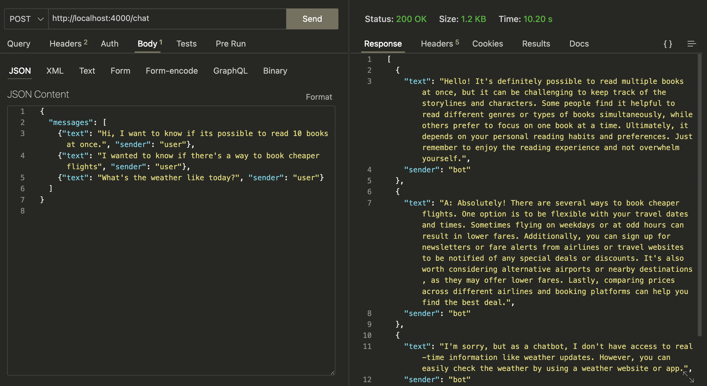
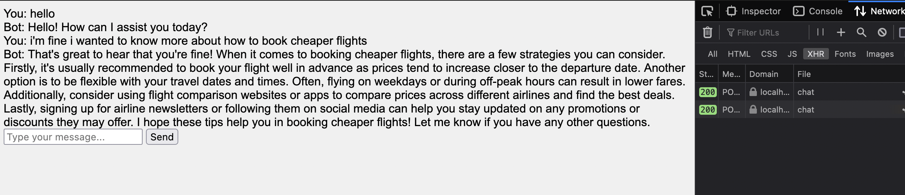

# Test Run (locally) 
`poetry run python textbase/textbase_cli.py test main.py`

# POST req. response

POST `http://localhost:4000/chat`

```
body:
{
  "messages": [
    {"text": "Hi, I want to know if its possible to read 10 books at once.", "sender": "user"},
    {"text": "I wanted to know if there's a way to book cheaper flights", "sender": "user"},
    {"text": "What's the weather like today?", "sender": "user"}
  ]
}
```



# Building cli locally
inside pyproject.toml add (if not included yet)-
```toml
[tool.poetry.scripts]
textbase = "textbase.textbase_cli:cli"
```

```bash
poetry build
pip install dist/textbase-0.1.0.tar.gz
```

```bash
textbase test main.py
```

# Local web hosting using `textbase test main.py`

