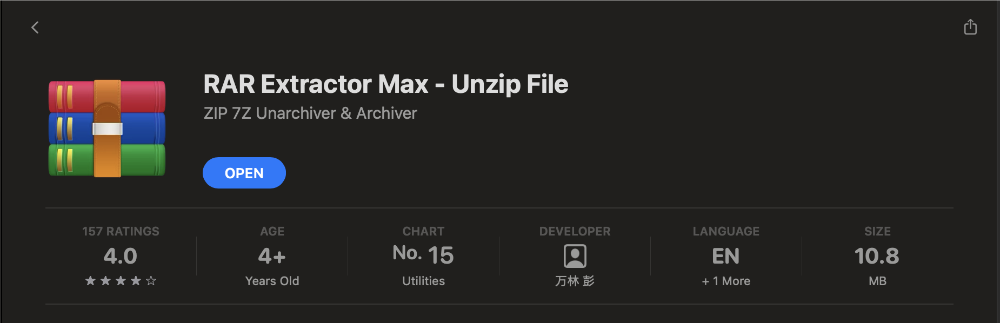

# Prerequisites
There are two methods to deploy your bot to the internet so that everyone can use it.

Before using any method, you need to ensure that:
1. You have a `requirements.txt` file which includes all the additional requirements which you might have installed while coding up the logic for your bot and it also contains the `textbase-client` requirement.
2. The name of the file in which the `on_message` function is present is named `main.py`.
3. You can have your own packages and modules in different folders and have relative imports to them. But the `main.py` and `requirements.txt` must **ABSOLUTELY NOT** be in any folder of their own. Do take a look at the [folder structures](#folder-structure) below for better understanding.
3. Archive these two (or more) files into a `.zip` archive. It's important that it's a **.zip** archive and not anything else.
    1. You can archive it yourself but we recommend you use the [compress](../usage.md#compress) command available from the CLI.
    2. If you wish to do this by yourself and you are using MacOS, please read the note below.

## Important note for MacOS users
Please download the software `RAR Extractor MAX` from App Store



for creating archives as MacOS creates an extra `__MACOSX` folder when compressing using the native compress utility which causes some issues with our backend.


## Folder structure
When you decide to archive the files, please **MAKE SURE** that main.py and requirements.txt are available in the **root** of the archive itself. As in if the zip is extracted, it will produce two (or more) files/folders.


### Good folder structure :white_check_mark:
```
your-bot.zip/
├── main.py
├── requirements.txt
└── your_package/
    └── your_module/
        └── sub_module
```
### Bad folder structure 1 :x:
```
your-bot.zip/
└── bot_folder/
    ├── main.py
    ├── requirements.txt
    └── your_package/
        └── your_module/
            └── sub_module
```

### Bad folder structure 2 :x:
```
your-bot.zip/
├── main_folder/
│   ├── main.py
│   └── requirements.txt
└── your_package/
    └── your_module/
        └── sub_module
```