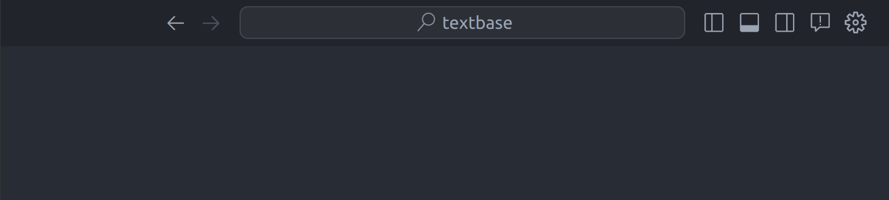

# Installation

Before starting with any of the given two tracks, go to https://github.com/cofactoryai/textbase
and follow the installation instructions to get started.

1. Fork the repository
2. Clone the repo
3. Open the repo in your VS Code

## [Video guide](https://youtu.be/pcw7G3S7FGw) (for Windows and Ubuntu >19.04)

1. Make sure to [upgrade/install](https://www.python.org/downloads/) your Python installation to a version >= 3.9 and add it to your `PATH` while installing.
2. Now, you need to [install](https://python-poetry.org/docs/#installation) `Poetry`, which is a python dependency manager which makes your life easier. To do so, you can just run `pip install poetry`.
3. Use the keyboard combo <kbd>Ctrl</kbd> + <kbd>Shift</kbd> + <kbd>P</kbd> (Mac: <kbd>&#8984;</kbd> + <kbd>Shift</kbd> + <kbd>P</kbd>) and search for `Terminal: Select Default Profile` and select `Command Prompt`.
4. You can open the VS Code terminal using <kbd>Ctrl</kbd> + <kbd>\`</kbd> (Mac: <kbd>&#8984;</kbd> + <kbd>\`</kbd>) and then run the command: `poetry config virtualenvs.in-project true` in the VSCode terminal inside the folder where you have cloned textbase repo to add it in VSCode path (interpreter path). This command does not give you any output.
5. `poetry shell`
6. Use the keyboard combo <kbd>Ctrl</kbd> + <kbd>Shift</kbd> + <kbd>P</kbd> (Mac: <kbd>&#8984;</kbd> + <kbd>Shift</kbd> + <kbd>P</kbd>) and select `Python: Select Interpreter` (you can type this option in if it's not visible) and make sure after running this you have selected the Poetry interpreter.

7. `poetry install` to install the required dependencies.

## Ubuntu (≤19.04)

1. Follow this [guide](https://gist.github.com/basaks/652eea861a143a9b3d11805c96273488) to install Python version 3.9.
2. Install pip using:
    ```bash
    sudo apt install python-pip
    ```
3. Install poetry using:
    ```bash
    pip install poetry
    ```
4. Add it to your path using:
    ```bash
    export PATH="$HOME/.local/bin:$PATH"
    ```
5. You can open the VS Code terminal using <kbd>Ctrl</kbd> + <kbd>\`</kbd> (Mac: <kbd>&#8984;</kbd> + <kbd>\`</kbd>) and then run the command: `poetry config virtualenvs.in-project true` in the VS Code terminal inside the folder where you have cloned textbase repo so that Poetry makes a `.venv` folder inside your current project directory. This command does not give you any output.
6. Running the commands below will make a new virtual Python environment inside the current directory and then you can select the default python interpreter to be the one in the `.venv` folder.
    ```bash
    cd textbase
    poetry shell
    ```
7. In order to select the default python interpreter in VS Code, <kbd>Ctrl</kbd> + <kbd>Shift</kbd> + <kbd>P</kbd> (Mac: <kbd>&#8984;</kbd> + <kbd>Shift</kbd> + <kbd>P</kbd>) and select `Python: Select Interpreter` (you can type this option in if it's not visible) and make sure after running this you have selected the Poetry interpreter.

8. `poetry install` to install all the required dependencies.