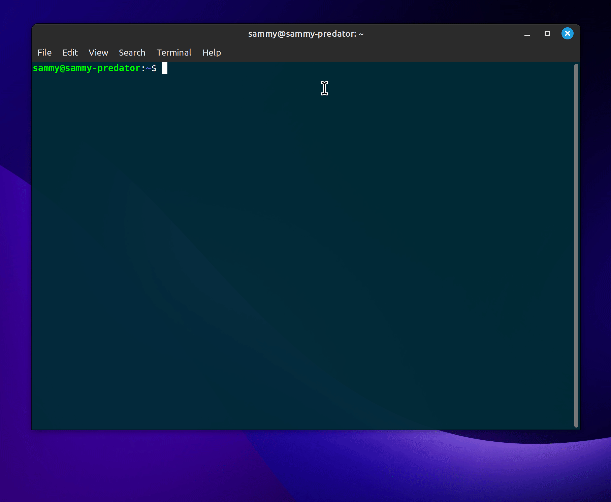

# Test locally
**Regardless of the method of installation, both of these commands will ask for a path to your `main.py` file. When giving this path, make sure that the path is *NOT* enclosed within quotes.**

Running any of the above commands will spin up a local server and a URL will be printed in your terminal. You can navigate to this URL to check if your bot works and interact with it!
## If you have installed the library from PyPI
```bash
textbase-client test
```

## If you have cloned the repo
For Linux and MacOS
```bash
poetry run python3 textbase/textbase_cli.py test
```
For Windows
```bash
poetry run python textbase/textbase_cli.py test
```
